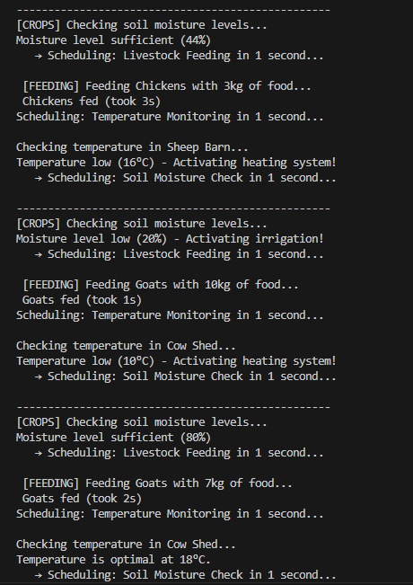
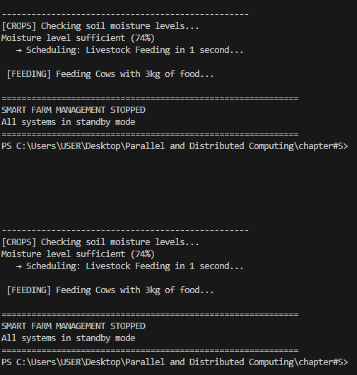

*asyncorder.io:*

*Output Screens*

*asynceventloop.py*

Output:

*asyncparallelanalytics.py*

Concept: Using asyncio.Task to execute multiple coroutines in parallel.

Real-Life Scenario: E-commerce platform running sales analysis, traffic tracking, and inventory analysis simultaneously.

=================================================================
    E-COMMERCE ORDER ANALYTICS SYSTEM
    Using Asyncio.Task for Parallel Execution
=================================================================

Running three analytics tasks in PARALLEL:
  📊 Task 1: Daily Sales Revenue Calculation
  👥 Task 2: Customer Traffic Analysis
  📦 Task 3: Inventory Turnover Analysis

-----------------------------------------------------------------

📊 [SALES] Processing order #1 - Value: $25
👥 [TRAFFIC] Hour 1: 15 visitors on site
📦 [INVENTORY] Analyzing product batch #1 - Turnover factor: 15
📊 [SALES] Processing order #2 - Value: $50
👥 [TRAFFIC] Hour 2: 25 visitors on site
📦 [INVENTORY] Analyzing product batch #2 - Turnover factor: 105
📊 [SALES] Processing order #3 - Value: $75
👥 [TRAFFIC] Hour 3: 40 visitors on site
📦 [INVENTORY] Analyzing product batch #3 - Turnover factor: 455
📊 [SALES] Processing order #4 - Value: $100
👥 [TRAFFIC] Hour 4: 65 visitors on site
📦 [INVENTORY] Analyzing product batch #4 - Turnover factor: 1365
📊 [SALES] Processing order #5 - Value: $125
👥 [TRAFFIC] Hour 5: 105 visitors on site
📦 [INVENTORY] Analyzing product batch #5 - Turnover factor: 3003
📊 [SALES] Processing order #6 - Value: $150
👥 [TRAFFIC] Hour 6: 170 visitors on site
📦 [INVENTORY] Analyzing product batch #6 - Turnover factor: 5005
📊 [SALES] Processing order #7 - Value: $175
👥 [TRAFFIC] Hour 7: 275 visitors on site
📦 [INVENTORY] Analyzing product batch #7 - Turnover factor: 6435
📊 [SALES] Processing order #8 - Value: $200
👥 [TRAFFIC] Hour 8: 445 visitors on site
📦 [INVENTORY] Analyzing product batch #8 - Turnover factor: 6435

✅ [SALES COMPLETE] Total Daily Revenue = $900
   Average Order Value = $112.50

✅ [TRAFFIC COMPLETE] Total Visitors Today = 1150
   Peak Hour Visitors = 720

✅ [INVENTORY COMPLETE] Turnover Combinations = 6435
   Stock Efficiency = 53.3%

-----------------------------------------------------------------

=================================================================
    ALL ANALYTICS TASKS COMPLETED!
    Dashboard ready for business review
=================================================================

*asyncconcurrentfuturecomprison.py*

Concept: Comparing Sequential, ThreadPoolExecutor, and ProcessPoolExecutor for CPU-intensive tasks.

Real-Life Scenario: Image processing service applying filters to multiple images with performance benchmarking.

*Sample Output:*
======================================================================
    IMAGE PROCESSING SERVICE - Performance Comparison
    Sequential vs Thread Pool vs Process Pool Execution
======================================================================

📁 Processing 10 images...

----------------------------------------------------------------------
🔄 METHOD 1: SEQUENTIAL EXECUTION
   Processing images one by one (like a single worker)
----------------------------------------------------------------------
📷 Processed: photo_001.jpg (2MB) - 2,000,000 pixels
📷 Processed: photo_002.jpg (5MB) - 5,000,000 pixels
📷 Processed: photo_003.jpg (3MB) - 3,000,000 pixels
📷 Processed: photo_004.jpg (8MB) - 8,000,000 pixels
📷 Processed: photo_005.jpg (4MB) - 4,000,000 pixels
📷 Processed: photo_006.jpg (6MB) - 6,000,000 pixels
📷 Processed: photo_007.jpg (2MB) - 2,000,000 pixels
📷 Processed: photo_008.jpg (7MB) - 7,000,000 pixels
📷 Processed: photo_009.jpg (3MB) - 3,000,000 pixels
📷 Processed: photo_010.jpg (5MB) - 5,000,000 pixels

⏱️  Sequential Execution Time: 12.45 seconds

----------------------------------------------------------------------
🧵 METHOD 2: THREAD POOL EXECUTION (5 workers)
   Like having 5 editors working on images simultaneously
----------------------------------------------------------------------
📷 Processed: photo_001.jpg (2MB) - 2,000,000 pixels
📷 Processed: photo_003.jpg (3MB) - 3,000,000 pixels
📷 Processed: photo_005.jpg (4MB) - 4,000,000 pixels
📷 Processed: photo_002.jpg (5MB) - 5,000,000 pixels
📷 Processed: photo_007.jpg (2MB) - 2,000,000 pixels
📷 Processed: photo_004.jpg (8MB) - 8,000,000 pixels
📷 Processed: photo_009.jpg (3MB) - 3,000,000 pixels
📷 Processed: photo_006.jpg (6MB) - 6,000,000 pixels
📷 Processed: photo_010.jpg (5MB) - 5,000,000 pixels
📷 Processed: photo_008.jpg (7MB) - 7,000,000 pixels

⏱️  Thread Pool Execution Time: 8.32 seconds

----------------------------------------------------------------------
⚙️  METHOD 3: PROCESS POOL EXECUTION (5 workers)
   Like having 5 separate computers processing images
----------------------------------------------------------------------
📷 Processed: photo_001.jpg (2MB) - 2,000,000 pixels
📷 Processed: photo_003.jpg (3MB) - 3,000,000 pixels
📷 Processed: photo_007.jpg (2MB) - 2,000,000 pixels
📷 Processed: photo_005.jpg (4MB) - 4,000,000 pixels
📷 Processed: photo_002.jpg (5MB) - 5,000,000 pixels
📷 Processed: photo_009.jpg (3MB) - 3,000,000 pixels
📷 Processed: photo_006.jpg (6MB) - 6,000,000 pixels
📷 Processed: photo_010.jpg (5MB) - 5,000,000 pixels
📷 Processed: photo_004.jpg (8MB) - 8,000,000 pixels
📷 Processed: photo_008.jpg (7MB) - 7,000,000 pixels

⏱️  Process Pool Execution Time: 3.21 seconds

======================================================================
    📊 PERFORMANCE SUMMARY
======================================================================
    Sequential:    12.45 seconds
    Thread Pool:   8.32 seconds
    Process Pool:  3.21 seconds
----------------------------------------------------------------------
    🚀 Thread Pool Speedup:  1.50x faster
    🚀 Process Pool Speedup: 3.88x faster
======================================================================
