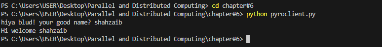

pyroserver.py:

*Server*

The Server is a Pyro4 object that exposes a method called welcomeMessage, which accepts a name as an argument and returns a personalized greeting.

*Code Explanation:*

*Server Class:*

The Server class is decorated with @Pyro4.expose, which means that the welcomeMessage method is exposed as a remote method accessible to clients.

The welcomeMessage method takes a string argument name and returns a formatted greeting: "Hi welcome {name}".

startServer Function:

This function initializes a Pyro4.Daemon, which is responsible for handling network requests for remote objects.

It then looks up a name server using Pyro4.locateNS() to register the server.

The server object (server) is registered with the daemon, and its URI is bound to the name server in the name server using ns.register().

The daemon enters a request loop (daemon.requestLoop()), waiting for client interactions.

How to Run the Server:

Ensure you have Pyro4 installed.

You can install it via pip install Pyro4.

Start the server by running the Python script.

The server will print the URI of the registered object, indicating that it is ready to accept client requests.

*Naming Server*

The Naming Server in Pyro4 is a key component for locating and accessing remote objects. It acts as a registry where clients can find the URI of the server.

*Code Explanation:*

Pyro4.locateNS() is used to locate the naming server. This assumes that the naming server is already running and accessible.

The server's URI is registered under the name "server". This means that the client can connect to this server object by requesting PYRONAME:server.

Setting Up the Naming Server:

You need to start the Pyro4 naming server before starting the actual server.

Run the following command in the terminal to start the naming server:
pyro4-ns

Ensure the naming server is running on the default port or configure it accordingly.

*Client*

The Client interacts with the server remotely by connecting to the server's URI through the Pyro4 proxy.

Code Explanation:

*Client Input:*

The client asks for the user's name using input("hiya blud! your good name? "), which it then strips of any surrounding whitespace.

Connecting to the Server:

The client creates a Pyro4 proxy with Pyro4.Proxy("PYRONAME:server"). This tells Pyro4 to locate the server object using the name "server" registered in the naming server.

Once connected, the client calls server.welcomeMessage(name), which sends the name to the server and prints the response (the personalized greeting).

How to Run the Client:

Make sure the server and naming server are both running.

Run the client script. The client will prompt for your name, and after entering it, the server will return a personalized greeting.

Output:
name server:

server:

client:

*addtask:*

This README provides a quick guide on setting up and using a basic Celery task with a message broker (RabbitMQ).

Overview

This example demonstrates how to use Celery for distributed task management in Python. The task simply adds two numbers together. The task is sent to a Celery worker which processes it asynchronously using RabbitMQ as the broker.

Requirements

Python 3.x

Celery:
Install using:

pip install celery

RabbitMQ as the message broker (or any supported broker):

Install RabbitMQ and start the service.

You can also use Redis or other brokers if preferred.

*Conclusion**

In this guide, we've covered two key examples: Pyro4 for remote object communication and Celery for distributed task management. Both examples demonstrate how Python can be used to create scalable systems that communicate asynchronously over a network.

*Key Takeaways:*

*Pyro4:*

Pyro4 allows for the creation of remote objects that can be accessed over a network by clients.

The Naming Server plays an important role in helping clients locate remote objects by their names.

We walked through the creation of a simple server exposing a welcomeMessage method and how the client can call this method remotely to receive a personalized greeting.

*Celery:*

Celery is a powerful tool for handling asynchronous tasks. By using a message broker (such as RabbitMQ), we can send tasks to workers that process them in the background.

We showed how to set up a basic Celery task that adds two numbers and processes it asynchronously using RabbitMQ as the broker.

Both Pyro4 and Celery can be extended to more complex systems, whether you're building distributed applications with remote object interactions or managing background tasks with worker queues.

By leveraging these tools, you can build efficient and scalable systems that handle remote procedure calls and distributed tasks, making Python a great choice for distributed systems and task management.